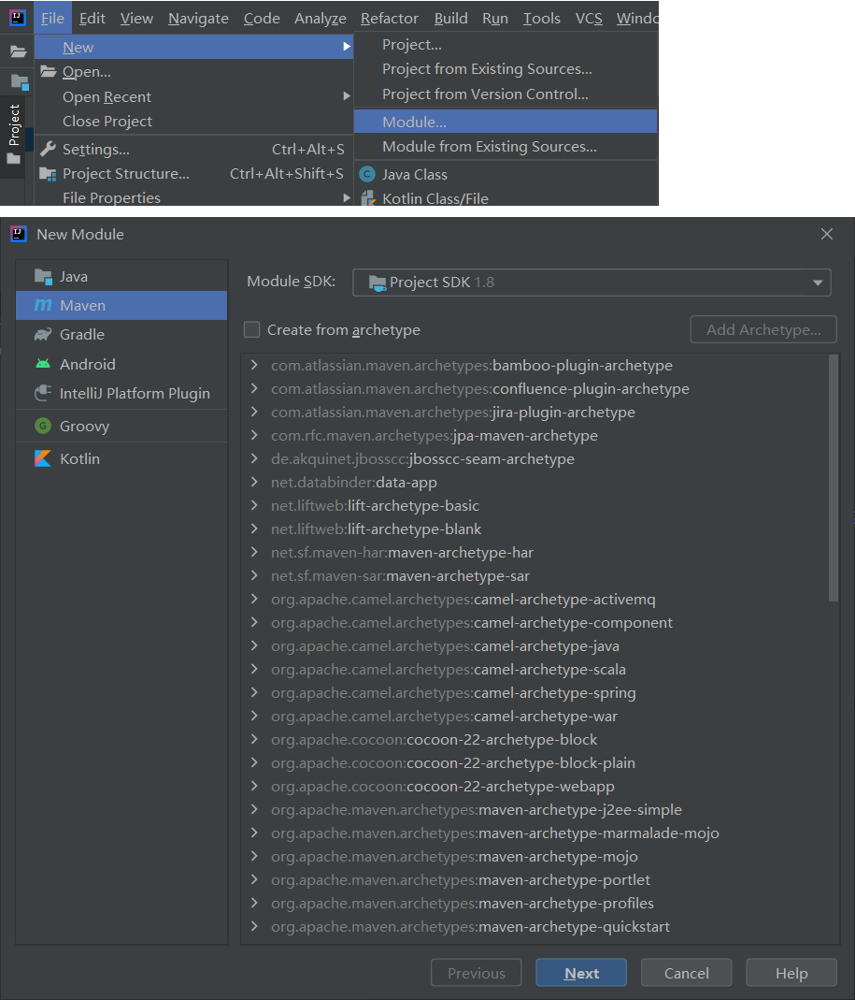
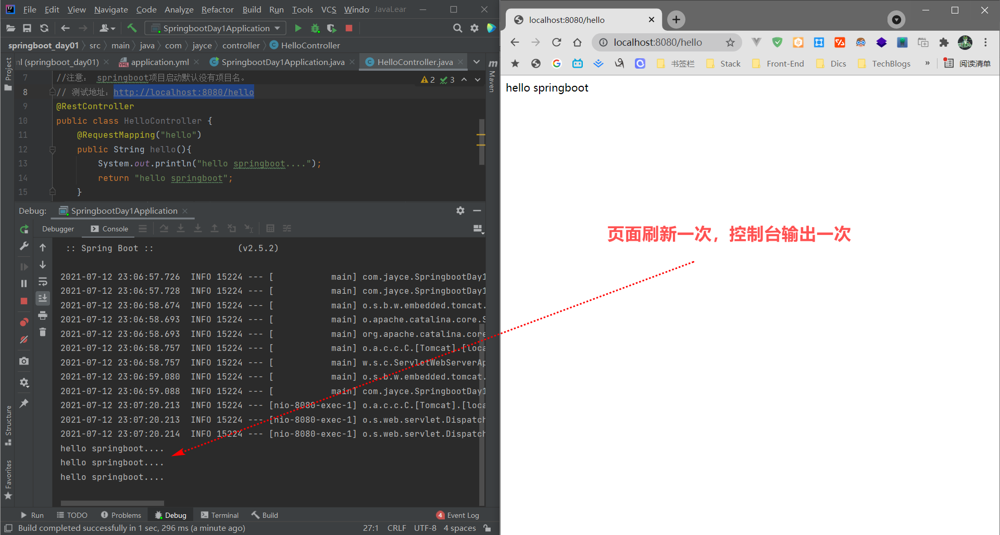

[toc]

## 1. 环境搭建


### 1.1 环境要求

```java
# 1. System Requirements
    JDK 1.8+
    MAVEN 3.2+
    Spring Framwork 5.x+
    
# 2.ServletContainers:
	Tomcat 9.0+

# 3.开发工具
    IDEA 2021版本
```


### 1.2 搭建

#### Step1 : IDEA 创建项目

File -> new ->module ->MAVEN -> 不勾选骨架 -> Next




新创建的目录结构如下：

```bash
.
└── springboot_day01
    ├── pom.xml
    ├── springboot_day01.iml
    └── src
        ├── main
        │   └── java
        └── test
            ├── java
            └── resources
```

test 目录下缺少了resources目录，手动添加(right click->new->Directory)后，目录结构为：

```bash
.
└── springboot_day01
    ├── pom.xml
    ├── springboot_day01.iml
    └── src
        ├── main
        │   ├── java
        │   └── resources
        └── test
            ├── java
            └── resources
```

#### Step2 新建项目中引入依赖

> springboot的依赖比较有意思，它要求我们的项目中必须去继承他的父级项目。需要在 springboot_day01/pom.xml 中编辑，该文件的初始化内容如下：

```xml
<?xml version="1.0" encoding="UTF-8"?>
<project xmlns="http://maven.apache.org/POM/4.0.0"
         xmlns:xsi="http://www.w3.org/2001/XMLSchema-instance"
         xsi:schemaLocation="http://maven.apache.org/POM/4.0.0 http://maven.apache.org/xsd/maven-4.0.0.xsd">
    <modelVersion>4.0.0</modelVersion>

    <groupId>org.example</groupId>
    <artifactId>springboot_day01</artifactId>
    <version>1.0-SNAPSHOT</version>


</project>
```

> 该操作需要配置maven仓库，参见 [link](https://blog.csdn.net/westos_linux/article/details/78968012)

##### 配置父项目继承

```xml
<?xml version="1.0" encoding="UTF-8"?>
<project xmlns="http://maven.apache.org/POM/4.0.0"
         xmlns:xsi="http://www.w3.org/2001/XMLSchema-instance"
         xsi:schemaLocation="http://maven.apache.org/POM/4.0.0 http://maven.apache.org/xsd/maven-4.0.0.xsd">
    <modelVersion>4.0.0</modelVersion>

    <groupId>org.example</groupId>
    <artifactId>springboot_day01</artifactId>
    <version>1.0-SNAPSHOT</version>

    <!--  继承springboot的父项目 便于维护版本  -->
    <parent>
        <groupId>org.springframework.boot</groupId>
        <artifactId>spring-boot-starter-parent</artifactId>
        <version>2.5.2</version>
    </parent>

</project>
```

##### 配置依赖

```xml
<?xml version="1.0" encoding="UTF-8"?>
<project xmlns="http://maven.apache.org/POM/4.0.0"
         xmlns:xsi="http://www.w3.org/2001/XMLSchema-instance"
         xsi:schemaLocation="http://maven.apache.org/POM/4.0.0 http://maven.apache.org/xsd/maven-4.0.0.xsd">
    <modelVersion>4.0.0</modelVersion>

    <groupId>org.example</groupId>
    <artifactId>springboot_day01</artifactId>
    <version>1.0-SNAPSHOT</version>

    <!--  继承springboot的父项目 便于维护版本  -->
    <parent>
        <groupId>org.springframework.boot</groupId>
        <artifactId>spring-boot-starter-parent</artifactId>
        <version>2.5.2</version>
    </parent>

    <dependencies>
        <dependency>
            <groupId>org.springframework.boot</groupId>
            <artifactId>spring-boot-starter-web</artifactId>
        </dependency>
    </dependencies>
</project>
```


#### Step3 配置springboot的两大约定

##### 约定1 ：

 要求当前的项目中有且有一个配置文件，配置文件的名字须为application.xml ，配置文件内容目前为空。

##### 约定2 ：

创建一个入口类

创建完成后的目录结构如下：

```bash
.
└── springboot_day01
    ├── pom.xml
    ├── springboot_day01.iml
    └── src
        ├── main
        │   ├── java
        │   │   └── com
        │   │       └── jayce
        │   │           ├── SpringbootDay1
        │   │           │   └── Application.java
        │   │           ├── controller
        │   │           ├── dao
        │   │           ├── entity
        │   │           ├── service
        │   │           └── utils
        │   └── resources
        │       └── application.yml
        └── test
            ├── java
            └── resources
```


要求入口类中必须要有一个main函数。

```java
/*file : springboot_day01/src/main/java/com/jayce/SpringbootDay1/Application.java */

package com.jayce.SpringbootDay1;

public class Application {
    public static void main(String[] args) {
        
    }
}

```


:warning: 注意：springboot要求main函数需要有一个注解`@SpringbootApplication`

```java
package com.jayce.SpringbootDay1;
import org.springframework.boot.autoconfigure.SpringBootApplication;

//这个注解, 修饰范围，只能用在入口类 （这个注解在项目中只能出现一次）
//其作用是 : 标识这个类是一个springboot的入口类，他是启动整个springboot项目的总入口
@SpringBootApplication
public class Application {
    public static void main(String[] args) {

    }
}

```

还需要显示的启动Springboot应用

```java
package com.jayce;

import org.springframework.boot.SpringApplication;
import org.springframework.boot.autoconfigure.SpringBootApplication;

//这个注解, 修饰范围，只能用在入口类 （这个注解在项目中只能出现一次）
//其作用是 : 标识这个类是一个springboot的入口类，他是启动整个springboot项目的总入口
@SpringBootApplication
public class SpringbootDay1Application {
    public static void main(String[] args) {
        //启动springboot应用的方法， 参数1： 指定入口类的类对象 2.main函数的参数
        SpringApplication.run(SpringbootDay1Application.class,args);
    }
}

```

至此 ， Springboot环境搭建完成


**总结：**

1. pom文件引入依赖
2. resources生成application.yml
3. 创建入口类加入`@SpringbootApplication`注解，在main 函数中启动应用


启动


> Springboot应用的启动相当于一运行，就把当前这个应用部署到了它内嵌的服务器，同时这个项目具备了Sping环境和SpringMvc 环境。


### 1.3 HelloWorld

springboot = springmvc(控制器controller) + spring(工厂)

创建一个controller

```java
.
└── springboot_day01
    ├── pom.xml
    ├── springboot_day01.iml
    ├── src
    │   ├── main
    │   │   ├── java
    │   │   │   └── com
    │   │   │       └── jayce
    │   │   │           ├── SpringbootDay1Application.java
    │   │   │           ├── controller
    │   │   │           │   └── HelloController.java //在这里
    │   │   │           ├── dao
    │   │   │           ├── entity
    │   │   │           ├── service
    │   │   │           └── utils
    │   │   └── resources
    │   │       └── application.yml
    │   └── test
    │       ├── java
    │       └── resources
    └── target	//自动生成的
        ├── classes
        │   ├── application.yml
        │   └── com
        │       └── jayce
        │           ├── SpringbootDay1Application.class
        │           └── controller
        │               └── HelloController.class 
        └── generated-sources	
            └── annotations
```

```java
/* file: HelloController.java */
package com.jayce.controller;

import org.springframework.web.bind.annotation.RequestMapping;
import org.springframework.web.bind.annotation.RestController;

//最简单的测试控制器
//注意： springboot项目启动默认没有项目名。
// 测试地址：http://localhost:8080/hello
@RestController
public class HelloController {
    @RequestMapping("hello")
    public String hello(){
        System.out.println("hello springboot....");
        return "hello springboot";
    }
}
```


启动项目，访问 ： http://localhost:8080/hello

### 




**附： 额外配置**

```yml
#application.yml

server:
  port: 8081 # 修改内嵌服务器端口号
  servlet:
    context-path: /springboot_day1 #修改项目名，注意：项目名必须以 “/” 开头
```


此时测试地址为： http://localhost:8081/springboot_day1/hello

