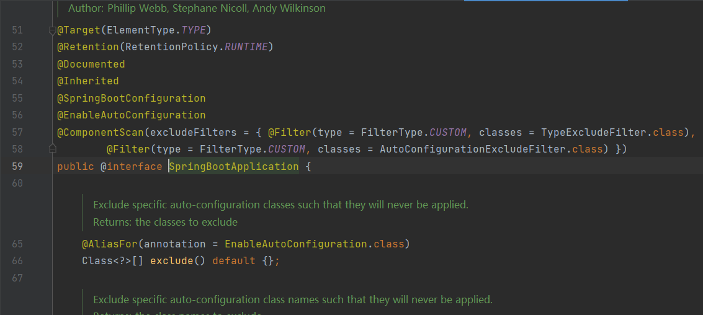

[toc]

## 相关注解的说明

### `@SpringBootApplication`

该注解是一个组合注解，所谓组合注解就是由多个注解组合而成的一个注解。

IDEA中Ctrl点击该注解，会跳入源码：

**元注解**：用来修饰注解的注解(是JDK提供的注解)

上图中的`@Target`、`@Retention`、`@Document`、`@Inhertited` 即元注解。其中：

`@Target` ： 指定注解的作用范围

`@Retention`	：指定注解的生效时机（什么时候有效）

这里更值得关注的是：`@SpringBootConfiguration`、`@EnableAutoConfiguration`、`@ComponentScan` 这几个SpringBoot相关的注解。 

可以理解为`@SpringBootApplication` 就是等价于 这三个注解的组合。 

- `@SpringBootConfiguration` ： 用来自动配置spring springmvc 相关环境，它会自动帮我们初始化好我们所需要的springboot环境。

- `@EnableAutoConfiguration` :  开启自动配置 ， 这是SpringBoot自动配置的核心注解，它能将`@SpringBootConfiguration` 初始化的环境生效，且自动与项目中引入的第三方技术自动配置环境。 

  > 例如在传统的ssm中使用redis, 那么需要一堆手动配置，该注解能够自动帮我们整合这些所有的三方技术的约定俗成的配置。流行的三方技术都已经整合好了，直接拿来用接好，只需要简单的出入口配置就可以开箱即用。例如mybatis-springboot, redis-springboot, es-springboot等。 

- `@ComponentScan` :  组件扫描注解，让springboot 能够扫描到我们自定义的注解，根据注解发挥其注解的作用，默认扫描当前包以及其子包。这也是为什么约定 “入口类必须在所有子包之上”的原因所在。 

`